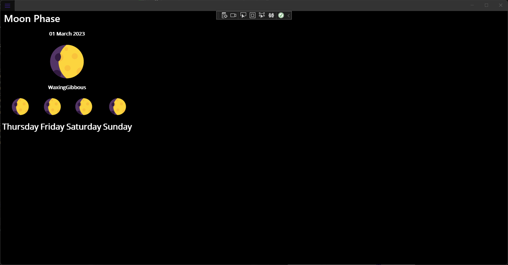
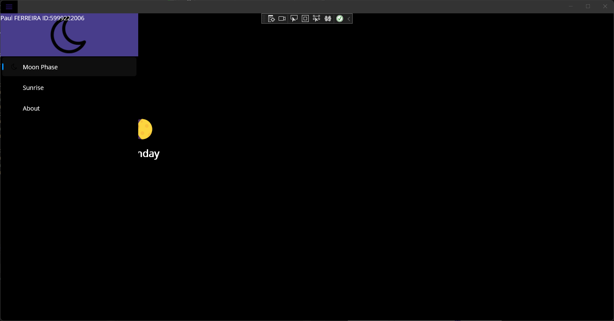
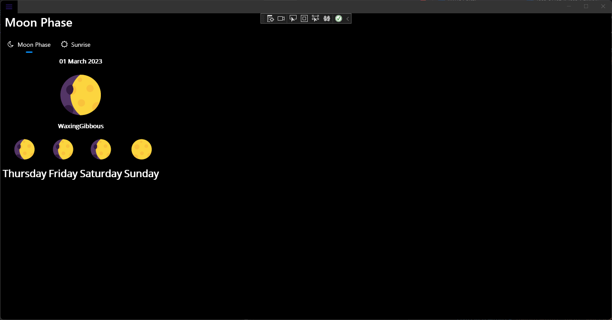
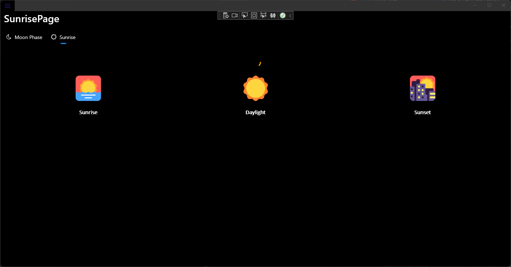
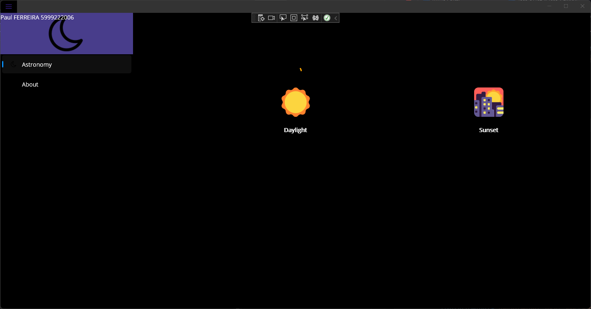
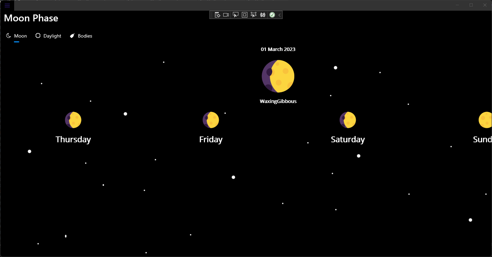
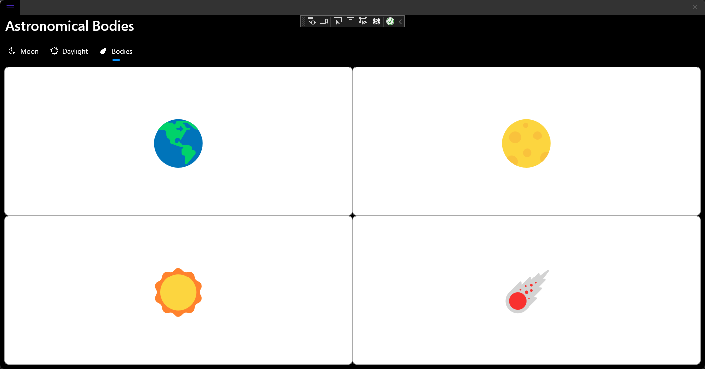
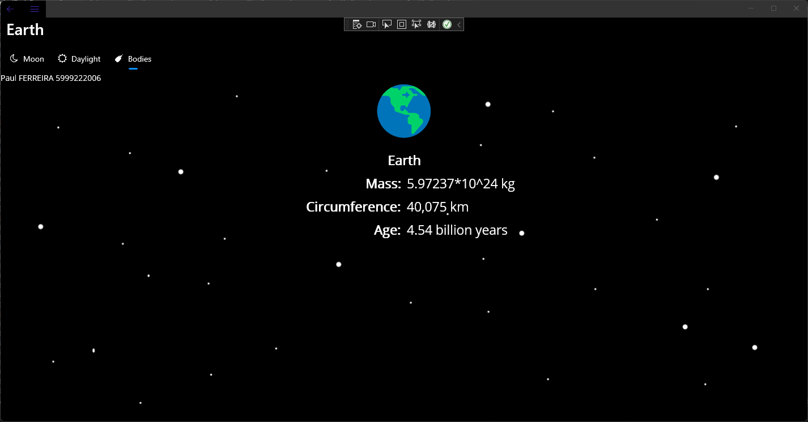
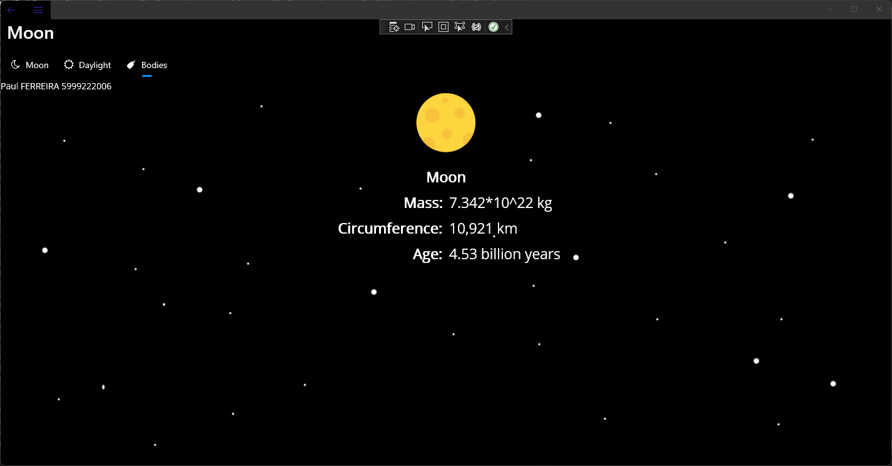
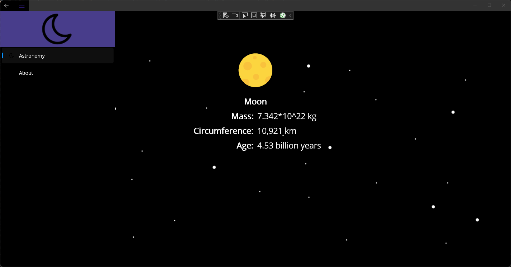

Paul FERREIRA - 5999222006

Exercice 1:

The issue with those screen and the next ones is that we don't see the icons of the moon, sun and about. It is because the picture are black and the background is black. I was unable to launch the program on a emulated phone and so the windows background only gives a black background on my laptop.

Exercice 2:

Exercice 3;

Thank you for watching,

Paul FERREIRA.
